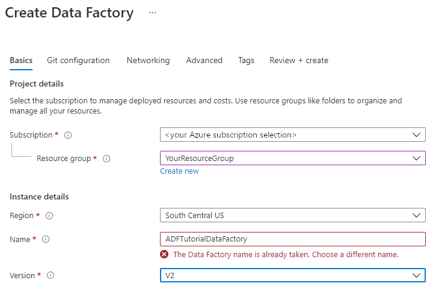
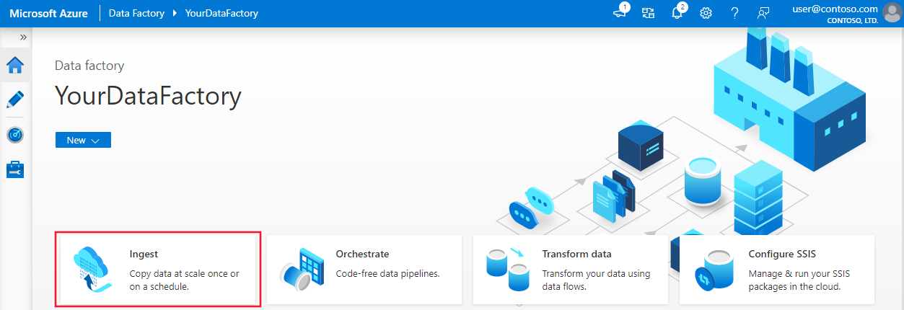
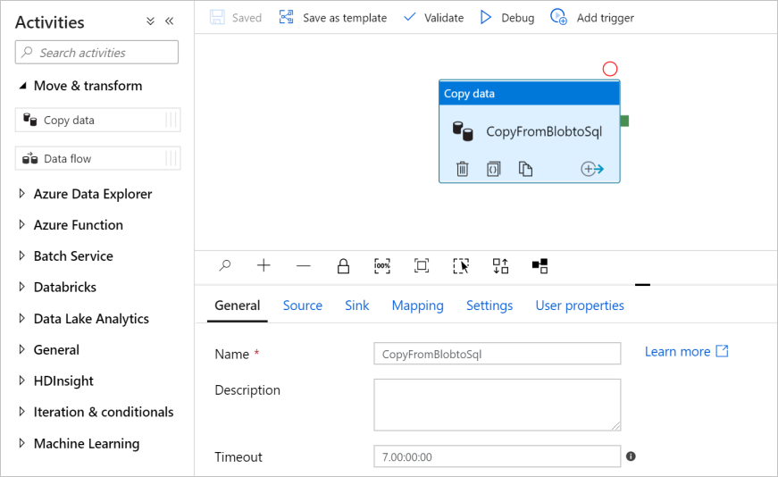
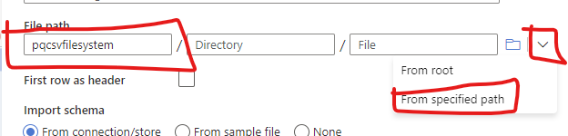
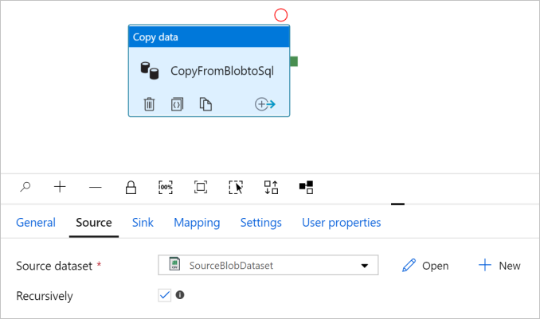
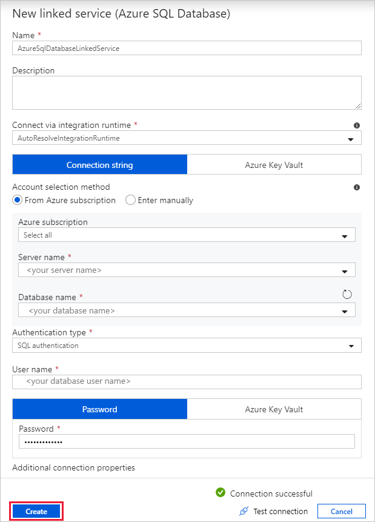
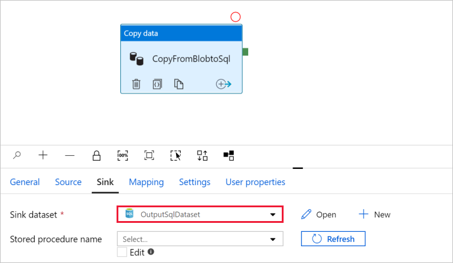

# Copy data from Azure Blob storage to a database in Azure SQL Database by using Azure Data Factory

In this tutorial, you create a data factory by using the Azure Data Factory user interface (UI). The pipeline in this data factory copies data from Azure Blob storage to a database in Azure SQL Database. The configuration pattern in this tutorial applies to copying from a file-based data store to a relational data store.

In this tutorial, you perform the following steps:

* Create a data factory.
* Create a pipeline with a copy activity.
* Test run the pipeline.
* Trigger the pipeline manually.
* Trigger the pipeline on a schedule.
* Monitor the pipeline and activity runs.

## Case

A few of our data scientists want to do research on user reviews. In our Data Engineering team, we've located the sources we needed. Of course, we will not query the sources directly, so one of your colleagues has already done an *ingest* action. Now, it's up to you to process this data into a useful dataset for data scientists.

The data is currently stored in a Data Lake Store account in the following structures:

* One "master" file of all registered customers on our website, exported as a CSV
* One daily live capture about online user profiles from our Marketing Intelligence department. This information is exported as a bunch of JSON files

In order to join all data together, we will first move the data into an SQL database.

### Create a blob and a SQL table

Now, prepare your SQL database for the tutorial by performing the following steps.

#### Create a sink SQL table

1. Navigate to the SQL Database
1. Use the following SQL script to create the **dbo.customers** and **dbo.onlineuserprofiles_reviews** tables in your database:

    ```sql
    CREATE TABLE [dbo].[customers] (
        [CustomerId] [nvarchar](10) NULL,
        [FirstName] [nvarchar](250) NULL,
        [MiddleInitial] [nvarchar](5) NULL,
        [LastName] [nvarchar](250) NULL,
        [FullName] [nvarchar](250) NULL,
        [Gender] [nvarchar](10) NULL,
        [Age] [nvarchar](10) NULL,
        [BirthDate] [nvarchar](20) NULL,
        [Address_PostalCode] [nvarchar](10) NULL,
        [Address_Street] [nvarchar](100) NULL,
        [Address_City] [nvarchar](100) NULL,
        [Address_Country] [nvarchar](250) NULL,
        [Mobile] [nvarchar](100) NULL,
        [Email] [nvarchar](100) NULL
    );
    GO
    CREATE TABLE [dbo].[onlineuserprofiles_reviews](
        [userId] [int] NULL,
        [cartId] [nvarchar](100) NULL,
        [productId] [int] NULL,
        [reviewText] [nvarchar](1000) NULL,
        [reviewDate] [nvarchar](100) NULL
    );
    ```

1. Allow Azure services to access SQL Server. Ensure that **Allow access to Azure services** is turned **ON** for your SQL Server so that Data Factory can write data to your SQL Server. To verify and turn on this setting, go to logical SQL server > Overview > Set server firewall> set the **Allow access to Azure services** option to **ON**.

## Create a data factory
In this step, you create a data factory and start the Data Factory UI to create a pipeline in the data factory.

1. Open **Microsoft Edge** or **Google Chrome**. Currently, Data Factory UI is supported only in Microsoft Edge and Google Chrome web browsers.
2. On the left menu, select **Create a resource** > **Integration** > **Data Factory**.
3. On the **Create Data Factory** page, under **Basics** tab, select the Azure **Subscription** in which you want to create the data factory.
4. Select for **Resource Group** the resource group in which all your resources live
   To learn about resource groups, see [Use resource groups to manage your Azure resources](https://docs.microsoft.com/en-us/azure/azure-resource-manager/management/overview). 
5. Under **Region**, select **West Europe**.
6. Under **Name**, enter **DataIngest*YourInitials***. Subsitute *YourInitials* with your initials.

> The name of the Azure data factory must be *globally unique*. If you receive an error message about the name value, enter a different name for the data factory. (for example, yournameADFTutorialDataFactory). For naming rules for Data Factory artifacts, see [Data Factory naming rules](https://docs.microsoft.com/en-us/azure/data-factory/naming-rules).
>
> 

7. Under **Version**, leave **V2** selected.
8. Select **Git configuration** tab on the top, and select the **Configure Git later** check box.
9. Select **Review + create**, and select **Create** after the validation is passed.
10. After the creation is finished, you see the notice in Notifications center. Select **Go to resource** to navigate to the Data factory page.
11. Select **Open** on the **Open Azure Data Factory Studio** tile to launch the Azure Data Factory UI in a separate tab.


## Create a pipeline

In this step, you create a pipeline with a copy activity in the data factory. The copy activity copies data from Blob storage to SQL Database.

In this tutorial, you start with creating the pipeline. Then you create linked services and datasets when you need them to configure the pipeline.

1. On the home page, select **Orchestrate**.
   

1. In the General panel under **Properties**, specify **CopyPipeline** for **Name**. Then collapse the panel by clicking the Properties icon in the top-right corner.

1. In the **Activities** tool box, expand the **Move and Transform** category, and drag and drop the **Copy Data** activity from the tool box to the pipeline designer surface. Specify **CopyFromBlobToSql** for **Name**.
    

### Configure source

>In this tutorial, you use *Account key* as the authentication type for your source data store, but you can choose other supported authentication methods: *SAS URI*,*Service Principal* and *Managed Identity* if needed. Refer to corresponding sections in [this article](https://docs.microsoft.com/en-us/azure/data-factory/connector-azure-blob-storage?tabs=data-factory#linked-service-properties) for details.
>To store secrets for data stores securely, it's also recommended to use an Azure Key Vault. Refer to [this article](https://docs.microsoft.com/en-us/azure/data-factory/store-credentials-in-key-vault) for detailed illustrations.

1. Go to the **Source** tab. Select **+ New** to create a source dataset.

1. In the **New Dataset** dialog box, select **Azure Blob Storage**, and then select **Continue**. The source data is in Blob storage, so you select **Azure Blob Storage** for the source dataset.

1. In the **Select Format** dialog box, choose the format type of your data (our first set, *customers*, is in CSV format, which is known here as **DelimitedText**), and then select **Continue**.

1. In the **Set Properties** dialog box, enter **SourceBlobDataset** for Name. Select the checkbox for **First row as header**. Under the **Linked service** text box, select **+ New**.

1. In the **New Linked Service (Azure Blob Storage)** dialog box, enter the following details:
   * Name: **SourceStorageAccount**
   * Connect via integration runtime: **AutoResolveIntegrationRuntime**
   * Authentication method: **SAS URI**
   * SAS URL: `https://pqcsvdemo.blob.core.windows.net/pqcsvfilesystem`
   * SAS token: `?sv=2020-10-02&st=2021-11-02T13%3A03%3A35Z&se=2021-11-09T13%3A03%3A00Z&sr=c&sp=rl&sig=qOW0wiV1ZH2DXn4lq2bQpEMb3aL4AQVpb1PRFy%2FLRK4%3D`
   * Test the connection by clicking **Test connection** (bottom right)
   * If everything is ok, click **Create**

1. After the linked service is created, it's navigated back to the **Set properties** page. 
   * Just below **File path**, enter the container where our files are stored: `pqcsvfilesystem`
   * Select the dropdown besides the **Browse** icon, and choose **"From specified path"**
   

1. Navigate to the **data-generators** folder, select the **generator-customer-clean.csv** file, and then select **OK**.

1. Select **OK**. It automatically navigates to the pipeline page. In **Source** tab, confirm that **SourceBlobDataset** is selected. To preview data on this page, select **Preview data**.

    
    
### Configure sink

>In this tutorial, you use *SQL authentication* as the authentication type for your sink data store, but you can choose other supported authentication methods: *Service Principal* and *Managed Identity* if needed. Refer to corresponding sections in [this article](https://docs.microsoft.com/en-us/azure/data-factory/connector-azure-sql-database?tabs=data-factory#linked-service-properties) for details.
>To store secrets for data stores securely, it's also recommended to use an Azure Key Vault. Refer to [this article](https://docs.microsoft.com/en-us/azure/data-factory/store-credentials-in-key-vault) for detailed illustrations.

1. Go to the **Sink** tab, and select **+ New** to create a sink dataset.

1. In the **New Dataset** dialog box, input "SQL" in the search box to filter the connectors, select **Azure SQL Database**, and then select **Continue**. In this tutorial, you copy data to a SQL database.

1. In the **Set Properties** dialog box, enter **OutputSqlDataset** for Name. From the **Linked service** dropdown list, select **+ New**. A dataset must be associated with a linked service. The linked service has the connection string that Data Factory uses to connect to SQL Database at runtime. The dataset specifies the container, folder, and the file (optional) to which the data is copied.

1. In the **New Linked Service (Azure SQL Database)** dialog box, take the following steps:

    a. Under **Name**, enter **AzureSqlDatabaseLinkedService**.

    b. Under **Server name**, select your SQL Server instance.

    c. Under **Database name**, select your database.

    d. Under **User name**, enter the name of the user.

    e. Under **Password**, enter the password for the user.

    f. Select **Test connection** to test the connection.

    g. Select **Create** to deploy the linked service.


    

1. It automatically navigates to the **Set Properties** dialog box. In **Table**, select **[dbo].[customers]**. Then select **OK**.

1. Go to the tab with the pipeline, and in **Sink Dataset**, confirm that **OutputSqlDataset** is selected.

    

You can optionally map the schema of the source to corresponding schema of destination by following [Schema mapping in copy activity](https://docs.microsoft.com/en-us/azure/data-factory/copy-activity-schema-and-type-mapping).

## Validate the pipeline

To validate the pipeline, select **Validate** from the tool bar.

You can see the JSON code associated with the pipeline by clicking **Code** on the upper right.

## Debug and publish the pipeline

You can debug a pipeline before you publish artifacts (linked services, datasets, and pipeline) to Data Factory or your own Azure Repos Git repository.

1. To debug the pipeline, select **Debug** on the toolbar. You see the status of the pipeline run in the **Output** tab at the bottom of the window.

1. Once the pipeline can run successfully, in the top toolbar, select **Publish all**. This action publishes entities (datasets, and pipelines) you created to Data Factory.

1. Wait until you see the **Successfully published** message. To see notification messages, click the **Show Notifications**  on the top-right (bell button).

## Next steps

You just created your first Data Pipeline! But we're not finished yet.

If this was an easy ride, here's a challenge: create another pipeline. This time, load the data from a 1,000 JSON files:

* Use the **Copy data** task again
* This time, create a new dataset for JSON files. Configure it with the following settings:
  * Linked Service: re-use **SourceStorageAccount** that you created earlier
  * Name of the dataset: **onlineuserprofiles_json**
  * File path:
    * container: `pqcsvfilesystem`
    * path: `online-user-profiles-01`
    * file: `0000001.json`

This dataset now points to a single file, which is useful for getting an idea of the schema we will get.

In the pipeline, configure the **source** such that this new **onlineuserprofiles_json** dataset is used with a **wildcard file path**. Configure the wildcard path like this:

* Wildcard folder path: `online-user-profiles-01/UserIdBucket=002`
* Wildcard file name: `*.json`

We're keeping it low-profile here, but if this one is working (check not only with **debug**, but have a look in SQL Database as well if records are arriving indeed). You can then try to broaden the wildcard pattern (for example: `online-user-profiles-01/UserIdBucker=00*` as wildcard folder).
